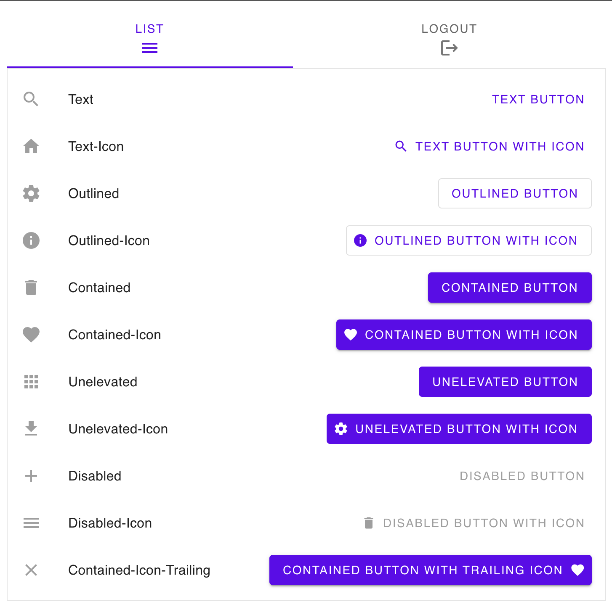

# haskell-halogen

[](https://github.com/Swordlash/haskell-halogen/actions/workflows/build.yml)

A port of [purescript-halogen](https://github.com/purescript-halogen/purescript-halogen/) to GHC
Haskell, plus the component and rendering libraries built on top of it.

The examples are deployed [here](https://swordlash.github.io/haskell-halogen/), as one single-page
app written in Halogen itself.

AI usage disclaimer: All code until tag `0.9.0` was hand-written. Any later commits might have used Codex or Claude.



## Packages

| Directory | Package | What it is |
| --- | --- | --- |
| [core/](core/) | `haskell-halogen-core` | The Halogen port itself: components, VDom, events, SVG, layouts. |
| [hooks/](hooks/) | `haskell-halogen-hooks` | A port of `purescript-halogen-hooks`: a component as one function. |
| [material/](material/) | `haskell-halogen-material` | Google Material Components bindings. |
| [pixi/](pixi/) | `haskell-halogen-pixi` | A PixiJS v8 canvas rendering backend. |
| [examples/](examples/) | `halogen-example-*` | One runnable browser app per library, and `all`, which mounts them in one page. |

`core` is dependency-free with respect to the others; `hooks`, `material` and `pixi` each depend
only on `core`. Every package builds from the one `cabal.project` at the repository root, so a change to
`core` is type-checked against every dependent and every example in the same build.

## The monad a component runs in

A component evaluates in the same monad the DOM is spoken in. Each backend is a newtype over `IO` —
`BrowserDOM`, `MemDOM`, and `PixiDOM` in `haskell-halogen-pixi` — so more than one can exist in a
single build and each can say, through associated type families, what its tree is made of.

An application with effects of its own stacks them on a backend and derives the classes through:

```haskell
newtype AppM a = AppM (ReaderT Config BrowserDOM a)
  deriving newtype (Functor, Applicative, Monad, MonadIO, PrimMonad, MonadDOM, MonadAttributes, MonadBrowserDOM)
```

The class methods have lifted defaults, so a transformer instance is only as long as its associated
types plus `mkEventListener`. `ReaderT` and `IdentityT` come with the library; `StateT` and friends
are deliberately absent, because the DOM calls a listener back and `mkEventListener` has to *run*
the transformer rather than lift it — a state update made inside a callback has nowhere to go.

The interface is split by what a backend actually has. `MonadDOM` is the mutable tree and its
listeners, and is all the reconciler uses. `MonadAttributes` adds named attributes and properties,
which only an HTML backend has. `MonadBrowserDOM` adds document splicing and the window globals,
and carries the equalities back to the concrete `Node` and `Element` as superclasses.

## Building

The library itself compiles under any GHC from 9.6 to 9.14; CI builds against 9.14.1, the version
the GitHub runner image ships. The browser targets need a cross-compiler.

```sh
npm install                  # once, for esbuild, sass and Material Components
npm run build-native         # every package, host GHC
npm run test                 # test suites across native, JavaScript and wasm
```

The cross-backend test scripts use Node 24 or later. They give each run a
temporary Web Storage file so storage tests exercise the browser FFI as well
as the native backend, without sharing a store between runs.

### WebAssembly

The default browser and deployment target. It requires the
[ghc-wasm-meta](https://gitlab.haskell.org/haskell-wasm/ghc-wasm-meta) toolchain to be bootstrapped
first — the build scripts source `~/.ghc-wasm/env` and will fail without it:

```sh
cd
git clone https://gitlab.haskell.org/haskell-wasm/ghc-wasm-meta.git
cd ghc-wasm-meta 
git checkout 358ea50b8496a69da6ce375c0c58bc049dbcb92d
SKIP_GHC=1 FLAVOUR=9.14 ./setup.sh
source ~/.ghc-wasm/env
ghcup -s "file://$HOME/ghc-wasm-meta/ghcup-wasm-0.0.9.yaml" install ghc "wasm32-wasi-9.14.1.20260731" --set -- $CONFIGURE_ARGS
```

That installs `wasm32-wasi-ghc` and friends under `~/.ghc-wasm`. The exact GHC version this
repository builds against is pinned in `cabal-wasm.project`, and `.github/workflows/build.yml`
pins the ghc-wasm-meta revision CI bootstraps from — keep the two in step when bumping either.

NOTE: use `cabal` version `3.16.1` on this repository.

With that in place, build and serve any example by name:

```sh
npm run serve-wasm -- pixi        # or: vanilla, hooks, material, all
npm run build-wasm-all            # every example, size-optimised with wasm-opt
npm run test-gallery              # drive the built `all` in headless Chromium
```

`all` is what GitHub Pages serves: every other example in one page and one binary, switched by the
URL's fragment (`#/pixi`), so the back button, reloads and deep links work on a static host.
`test-gallery` needs a Chromium that Playwright can launch (`npx playwright install chromium`).

`serve-wasm` opens <http://127.0.0.1:8080> automatically. Set `PORT` to choose another port, or
`NO_OPEN=1` to suppress opening the browser (for example in CI).

For browser hot reload of the material example, install
[ghciwatch](https://mercurytechnologies.github.io/ghciwatch/) and run `npm run dev-wasm`. This
starts wasm browser GHCi, opens its Material-enabled page, and reruns `main` after Haskell source
changes.

### JavaScript backend

Needs a `javascript-unknown-ghcjs-ghc` cross-compiler; the easiest way to get one is the `ghcup`
precompiled binaries described [here](https://www.haskell.org/ghcup/guide/#cross-support).

```sh
npm run serve-ghcjs -- vanilla    # cabal build + http-server
npm run build-js                  # material example, bundled into dist/ with esbuild
npm run build-js-dev              # the same, without minification or brotli
```

Build artifacts are kept in `dist-newstyle/native`, `dist-newstyle/javascript`,
`dist-newstyle/wasm` and `dist-newstyle/wasm-dev` respectively.

## Adding an example

Create `examples/<name>/` with a `halogen-example-<name>.cabal` (executable named
`halogen-example-<name>`), a `Main.hs`, and a `web/` directory holding `index.html` and an
`index.js` that fetches `./app.wasm`. The `examples/*` glob in `cabal.project` picks the package up,
and `toolchain/build-wasm-all.sh` picks up the directory. If the example needs bundling, add a
`bundle.sh` beside it and the build script will run it, passing the output directory as its
argument.

To show it in the deployed gallery as well, put its component in a library module
(`src/Example/<Name>.hs`, as the existing examples do, with `Main.hs` only starting it), depend on
that library from `examples/all`, and add a route to `examples/all/Gallery.hs`.

## Hooks

`haskell-halogen-hooks` writes a component as one function from its input to its HTML, asking for
state, effects, memoised values and a query handler as it goes, instead of spreading them across
`initialState`, `render` and `handleAction`:

```haskell
counter :: H.Component H.VoidF () Void BrowserDOM
counter = Hooks.component @Empty $ \_input -> Hooks.do
  (count, countId) <- Hooks.useState (0 :: Int)

  Hooks.useTickEffect count $ do
    liftIO $ putStrLn ("count is now " <> show count)
    pure Nothing

  Hooks.pure $
    HH.div_
      [ HH.button [HE.onClick $ \_ -> Hooks.modify_ countId (+ 1)] [HH.text "more"]
      , HH.text (show count)
      ]
```

`Hooks.do` is `QualifiedDo`, because a hook program is an indexed monad indexed by the list of
hooks it uses. That is what enforces the rules of hooks — the same hooks in the same order on
every render, since the interpreter walks a store of cells in step with the program — and it
enforces them at compile time: a `useState` inside an `if` does not type-check. A composite hook
is a parameterised type synonym over the same list:

```haskell
type UseCounter hooks = UseState Int : UseEffect Int : hooks
```

`Halogen.Hooks.Extra.Hooks` ports
[purescript-halogen-hooks-extra](https://github.com/JordanMartinez/purescript-halogen-hooks-extra)
into the same package rather than a second one: `useDebouncer`, `useThrottle`, `useGet`,
`useEvent`, the `useStateFn` family, and `preventDefault` and friends for handlers that have to
stop the browser handling the same event. `usePrevious` and the `useLocalStorage` family come
from that library's own examples. Storage is a `MonadBrowserDOM` operation, so the in-memory
backend has it too and what a page persists can be tested without a browser; a store holds one
prefixed entry per key, with a base64 value, and `Web.Storage.Serialize` says how a value becomes bytes — JSON by
default, for any type with aeson instances. None of them is primitive — each is written with the hooks
above and nothing else, and each is worth reading as an example of a composite hook.
[examples/hooks/](examples/hooks/) is a page that uses every one of them.

The PureScript original has to do several of these things at runtime, and GHC's type system means
this port does not. The hook list is a type-level list rather than a chain of newtypes; the cell
store is indexed by it, so a cell is read back at the type it was written rather than coerced out
of an array; a state handle is branded with the component that owns it, the way `ST` brands an
`STRef`, so it cannot be raised as an output or stashed somewhere that outlives its component;
effect and memo dependencies are an ordinary value compared with `==` (or with a comparison of
your own, through `useTickEffectBy` and `useMemoBy`), so
`Hooks.captures {x, y} Hooks.useTickEffect` becomes `Hooks.useTickEffect (x, y)`; and a
component's query algebra is part of its hook program's type, so there is no `componentWithQuery`
and no tokens to pass around.

## Canvas rendering

`Halogen.Canvas` (in `core`) is a component that owns a canvas DOM node and delegates to a
`Renderer` record, which a backend implements by supplying `mount`, `update` and `destroy`.

A scene is described in `Halogen.Canvas.Elements` and `Halogen.Canvas.Properties` (both in `core`),
which read like `Halogen.HTML.Elements` and `Halogen.HTML.Properties`: `group`, `line`, `rectangle`,
`circle`, `ellipse`, `arc`, the Bézier curves, `path`, `text` and `sprite`, each taking a list of
props, with a `_` variant for the styling-free case. `path` takes the same commands as an `<svg>`
`d` attribute, from `Halogen.Svg.Attributes`, so one drawing serves both. Props carry the transform, the cursor, the hit area and
pointer handlers — `onClick`, `onPointerDown`, `onPointerUp`, `onPointerOver`, `onPointerOut` and
`onPointerMove`. `outline` frames an element with a border the backend measures, which is the only
way to get one that is right: nothing writing a scene can know a label's extent, or a sprite's
before its texture has loaded. It is measured against the same bounds the backend hit-tests, so it
also shows exactly what is clickable. Higher-level drawings such as grids are ordinary Haskell composition rather than
renderer primitives. Handler actions are raised as typed component outputs; camera changes are
reported separately.

The vocabulary the scene is written in (`Halogen.Canvas.Types`) is backend-neutral, and a scene is an
ordinary `VDom`, so it reconciles through `Halogen.VDom.DOM.buildVDom` — the same machinery that
reconciles HTML. `haskell-halogen-pixi` supplies a PixiJS v8 interpretation of it: a `MonadDOM`
instance whose nodes are Pixi display objects, plus a prop applicator that paints them.

Give stable scene items keys with `keyedGroup` or `withKeys`. Subsequent `View` inputs reconcile
those keys, retain their display objects and listeners, and only repaint what changed; removed keys
are destroyed. Unkeyed siblings are matched by position, so explicit keys are only needed when
identity must survive insertion, removal or reordering. Camera transforms operate directly on the
retained scene. Pan changes are reported when the gesture ends, while wheel changes are coalesced
until the wheel burst has been idle for 120 ms.

Each mounted canvas owns its own Pixi `Application`, renderer, stage, event system and GPU canvas
context. Browsers cache evaluation of the dynamically imported Pixi module by URL, so multiple
canvases reuse the same module and Pixi asset cache rather than downloading and evaluating Pixi
repeatedly.

The default renderer loads its pinned PixiJS module from jsDelivr when mounted, so applications need
no Pixi JavaScript shim or global — but the example does need network access when opened. Use
`componentWith (Config { moduleUrl = ... })` to load a self-hosted or bundled PixiJS v8 module
instead.

## Releases

One repository, one tag namespace: releases are tagged with a package prefix, such as `core-v0.10.0`
or `material-v0.2.0`. Each package keeps its own `CHANGELOG.md` and uploads to Hackage separately.
